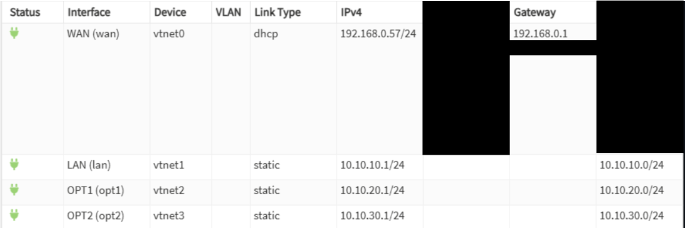
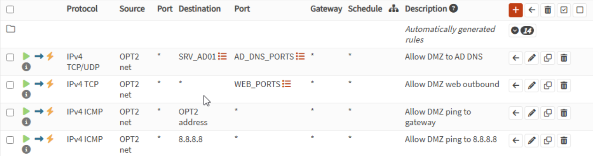
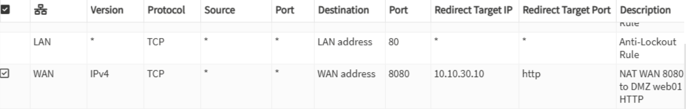
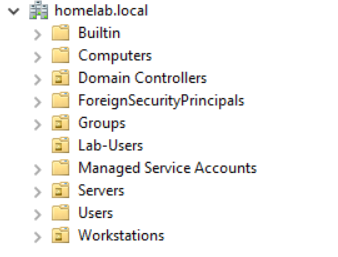
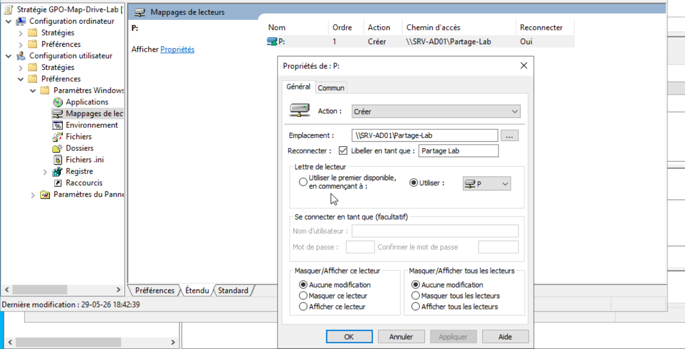
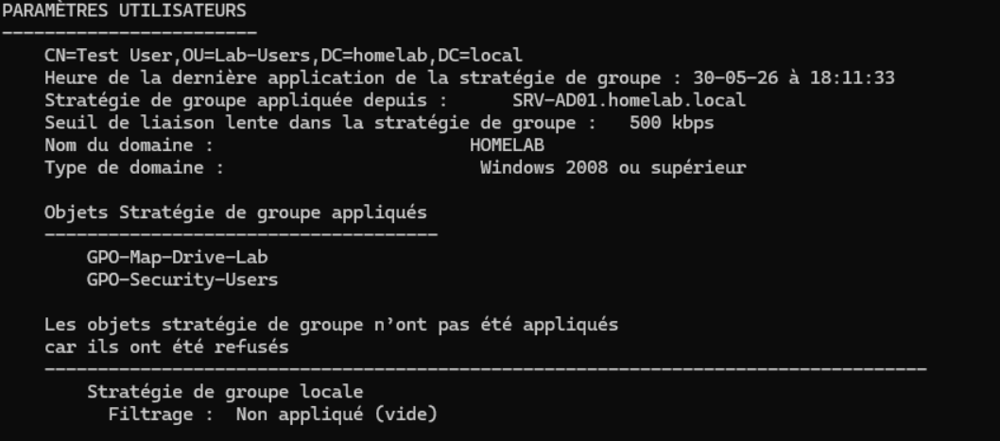
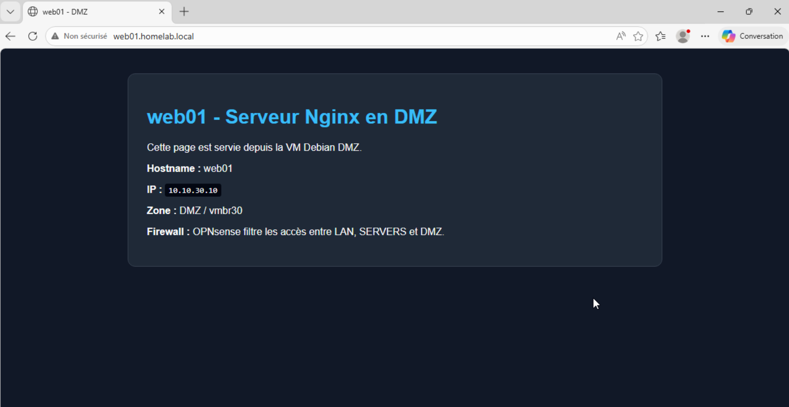
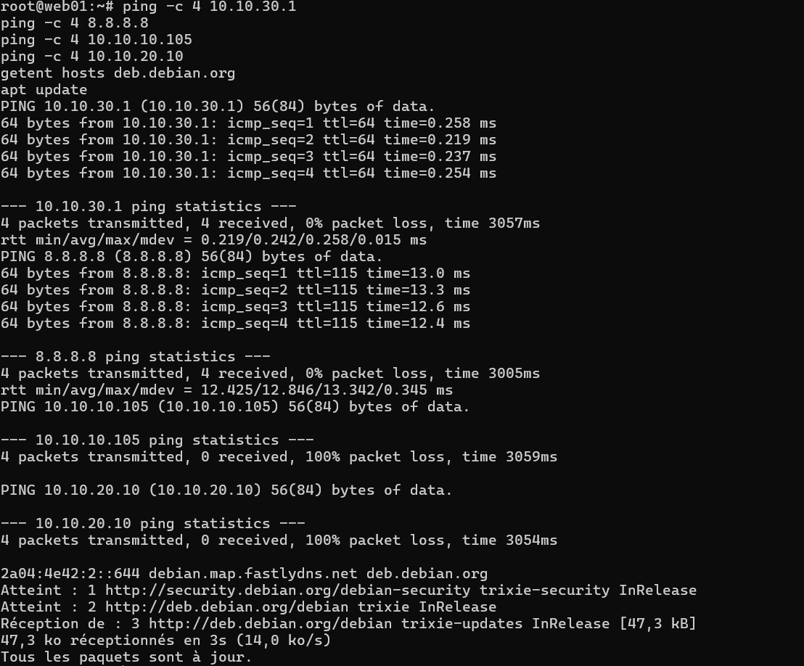
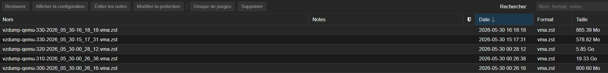

# Windows Server Active Directory + OPNsense Homelab

Enterprise-style homelab built on Proxmox VE to practice system and network administration.

## Overview

This lab simulates a small business infrastructure with network segmentation, Active Directory, Group Policy, a DMZ web server, firewall rules, NAT publication, and backup/recovery practices.

## Network Zones

- WAN / Home Network: 192.168.0.0/24
  - External network used as the OPNsense WAN.

- LAN: 10.10.10.0/24
  - Domain client workstations.

- SERVERS: 10.10.20.0/24
  - Internal servers such as Active Directory and DNS.

- DMZ: 10.10.30.0/24
  - Exposed services such as the Nginx web server.

## Main Virtual Machines

- OPNsense
  - Role: Firewall/router
  - IPs: 192.168.0.57 / 10.10.10.1 / 10.10.20.1 / 10.10.30.1

- SRV-AD01
  - Role: Windows Server AD DS + DNS
  - IP: 10.10.20.10

- WIN11-LAB
  - Role: Domain-joined Windows 11 client
  - IP: 10.10.10.105

- web01
  - Role: Debian/Nginx DMZ web server
  - IP: 10.10.30.10

## Implemented Features

- Proxmox VE virtual networking with isolated bridges.
- OPNsense firewall with LAN / SERVERS / DMZ segmentation.
- Windows Server Active Directory domain: homelab.local.
- AD-integrated DNS.
- Windows 11 domain-joined client.
- Organizational Units, users and security groups.
- Group Policy Objects.
- File share with AD group-based permissions.
- Automatic drive mapping through GPO.
- Debian/Nginx web server in the DMZ.
- Internal DNS record: web01.homelab.local -> 10.10.30.10.
- WAN-to-DMZ NAT: 192.168.0.57:8080 -> 10.10.30.10:80.
- Firewall hardening between LAN, SERVERS and DMZ.
- Proxmox snapshots and vzdump backups.

## Validation Summary

- Windows 11 domain join: Success.
- nltest /dsgetdc:homelab.local: Success.
- gpupdate /force: Success.
- Drive mapping through GPO: Success.
- web01.homelab.local DNS resolution: Success.
- LAN to DMZ HTTP access: Success.
- WAN to DMZ NAT on port 8080: Success.
- DMZ to LAN ping: Blocked as expected.
- DMZ to SRV-AD01 ping: Blocked as expected.
- DMZ to SRV-AD01 DNS: Allowed.
- DMZ to Internet HTTP/HTTPS: Allowed.

## Security Approach

The lab follows a least-privilege firewall model.

Default broad firewall rules were disabled and replaced with targeted rules.

The DMZ can access the Internet for updates and query internal DNS, but it cannot freely access the LAN or internal servers.

## Screenshots

### Network and Firewall

### Active Directory and Group Policy

### DMZ Web Server

### Backup and Recovery

## Status

Lab implementation is complete and validated. Documentation is in progress.
