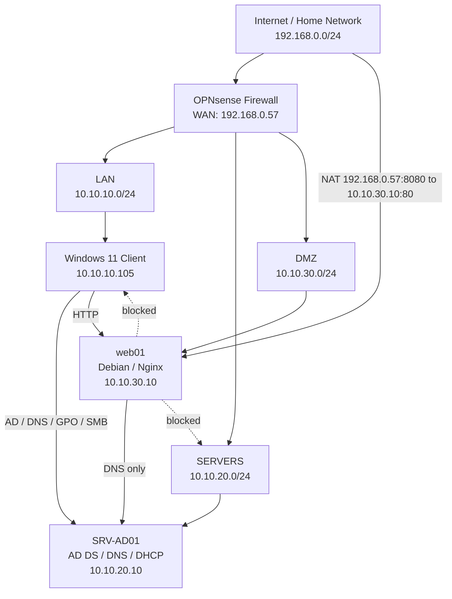

# Network Architecture Diagram

This diagram represents the validated network segmentation used in the Windows Server AD and OPNsense homelab.

## Security Model

The lab uses segmented networks to separate client, server and DMZ workloads.

- LAN clients can access Active Directory services on SRV-AD01.
- LAN clients can access the DMZ web server over HTTP.
- The DMZ web server can resolve DNS through SRV-AD01.
- The DMZ is not allowed to freely access LAN or SERVERS.
- WAN access to the DMZ web server is published through a controlled NAT rule.
- Broad allow rules were replaced by targeted firewall rules after validation.

## Main Networks

| Zone | Subnet | Purpose |
|---|---:|---|
| WAN / Home network | 192.168.0.0/24 | Upstream home network |
| LAN | 10.10.10.0/24 | Client devices |
| SERVERS | 10.10.20.0/24 | Domain controller and server workloads |
| DMZ | 10.10.30.0/24 | Public-facing services |

## Main Hosts

| Host | Role | IP |
|---|---|---:|
| OPNsense | Firewall/router | 192.168.0.57 / 10.10.10.1 / 10.10.20.1 / 10.10.30.1 |
| win11-client-lab | Domain client | 10.10.10.105 |
| SRV-AD01 | AD DS, DNS, DHCP | 10.10.20.10 |
| web01 | Debian Nginx DMZ web server | 10.10.30.10 |
